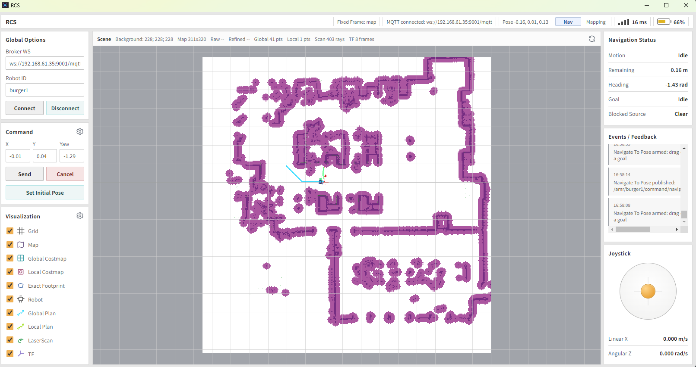
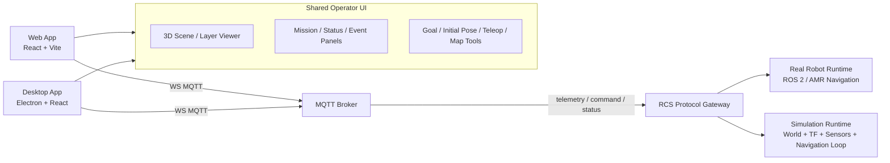

# RCS


Robot Control System for AMR operations, visualization, and simulation.

이 프로젝트는 `amr_viz`의 강점을 계승하되, 단순 시각화 클라이언트가 아니라 다음을 포함하는 운영 시스템을 목표로 한다.

- Electron 기반 데스크톱 앱
- 동일 코드베이스를 공유하는 Web 앱
- MQTT/WS 기반 실시간 운영 통신
- AMR navigation 검증용 시뮬레이션 런타임
- 3D scene 기반 상태 관제, 제어, 디버깅

핵심 방향은 `Electron-first`가 아니라 `shared web core + Electron shell`이다. 즉, 운영 UI와 3D 렌더러는 Web 기술로 공통 구현하고, 데스크톱에서는 Electron이 네이티브 패키징과 로컬 연동만 담당한다.

## Product Direction

RCS는 실로봇과 시뮬레이터를 같은 운영 모델로 다루는 것을 목표로 한다.

- operator는 브라우저 또는 데스크톱 앱에서 동일한 화면과 기능을 사용한다
- robot-side runtime은 MQTT broker를 통해 telemetry, status, feedback을 publish 한다
- operator-side runtime은 WebSocket MQTT로 직접 접속해 ROS 비의존 운영 환경을 유지한다
- simulation runtime은 실기와 같은 topic/schema를 흉내 내는 것이 아니라, 가능한 한 같은 계약(contract)으로 동작해야 한다
- 3D visualization은 단순 viewer가 아니라 navigation 상태 해석 도구여야 한다
- mapping / navigation / recovery / operator tooling / simulation 책임을 명확히 분리한다

## Architecture



## Major Capabilities

### 1. Operator Console

- 3D map / costmap / path / scan / TF visualization
- robot pose, goal marker, initial pose marker editing
- navigation status, recovery state, connectivity, latency 표시
- robot selection and multi-session switching
- event timeline, alarm, and command audit trail

### 2. Navigation Control

- `navigate_to_pose`
- `cancel_navigate`
- `set_initial_pose`
- teleop and recovery-trigger commands
- mission preset and waypoint sequence execution

### 3. Simulation

- `pgm + yaml` 기반 occupancy world 로딩
- world obstacle, wall, keepout zone 편집
- simulated TF tree 발행
- simulated robot pose / odom / scan / map / costmap 생성
- 실제 navigation stack 또는 RCS planner와의 연동
- navigation 검증, 회복 시나리오, obstacle replay

### 4. Shared Runtime Model

- desktop/web 동일한 protocol, renderer, state model 사용
- robot / simulation / replay session을 같은 뷰 모델로 관리
- transport는 MQTT 중심, 접속은 WebSocket 우선

## Why Shared Web Core Instead Of Electron-Only

`amr_viz`의 가장 큰 장점은 운영 화면이 ROS에 종속되지 않고 browser에서 바로 접근된다는 점이다. RCS도 그 장점을 유지해야 한다.

- web 앱은 배포와 원격 접근이 쉽다
- desktop 앱은 현장 운영에서 창 관리, 파일 접근, 로컬 설정 저장에 유리하다
- 공통 React/Three.js core를 두면 두 채널의 기능 격차를 줄일 수 있다
- Electron을 셸로 제한하면 UI 복잡도가 불필요하게 증가하지 않는다

## Current Repository Layout

```text
ros-rcs/
  apps/
    desktop/          # Electron shell
    web/              # React/Vite web entry
  packages/
    ui/               # shared panels, layout, state hooks
    scene3d/          # Three.js scene, layers, camera, interaction
    protocol/         # MQTT topic helpers, schemas, DTOs
```

Planned next packages and services:

```text
ros-rcs/
  packages/
    sdk/              # command client, session client, replay client
    map-core/         # occupancy grid, pgm/yaml parser, geometry utils
    sim-core/         # world model, tf, kinematics, sensor simulation
  services/
    gateway/          # optional bridge/api/session manager
    simulator/        # standalone simulation runtime
  docs/
    protocol/
    architecture/
```

## MQTT Model

현재 RCS 기본 topic은 `/amr/{robot_id}/...` 형태의 AMR MQTT API를 따른다. `robot_id` 는 좌측 `Robot ID` 입력값으로 치환된다. MQTT topic은 문자열 exact match라서 `amr/**` 와 `/amr/**` 는 다른 topic으로 취급된다. `Tools`와 `Displays` 우상단 설정 모달에서 command/viz topic을 수정할 수 있고, 마지막 저장값은 renderer localStorage에 저장되어 재실행 시 복원된다.

Default raw telemetry:

- `/amr/{robot_id}/telemetry/map`
- `/amr/{robot_id}/telemetry/tf_static`
- `/amr/{robot_id}/telemetry/robot_description`
- `/amr/{robot_id}/telemetry/scan`
- `/amr/{robot_id}/telemetry/odom`
- `/amr/{robot_id}/telemetry/imu`
- `/amr/{robot_id}/telemetry/tf`
- `/amr/{robot_id}/telemetry/joint_states`
- `/amr/{robot_id}/telemetry/robot_pose`
- `/amr/{robot_id}/telemetry/global_costmap`
- `/amr/{robot_id}/telemetry/local_costmap`
- `/amr/{robot_id}/telemetry/global_path`
- `/amr/{robot_id}/telemetry/local_path`
- `/amr/{robot_id}/telemetry/motion_status`
- `/amr/{robot_id}/telemetry/battery_state`

Default viz:

- `/amr/{robot_id}/viz/map`
- `/amr/{robot_id}/viz/global_costmap`
- `/amr/{robot_id}/viz/local_costmap`
- `/amr/{robot_id}/viz/robot_pose`
- `/amr/{robot_id}/viz/global_path`
- `/amr/{robot_id}/viz/local_path`
- `/amr/{robot_id}/viz/motion_status`
- `/amr/{robot_id}/viz/scan`
- `/amr/{robot_id}/viz/battery_state`
- `/amr/{robot_id}/viz/tf`
- `/amr/{robot_id}/viz/tf_static`
- `/amr/{robot_id}/viz/robot_description`

Commands:

- `/amr/command/navigate_to_pose`
- `/amr/command/cancel_navigate_to_pose`
- `/amr/command/set_initial_pose`
- `rcs/<targetKind>/<targetId>/command/reset_world`

Responses and status:

- `rcs/<targetKind>/<targetId>/response/#`
- `rcs/<targetKind>/<targetId>/feedback/#`
- `rcs/<targetKind>/<targetId>/status/#`
- `rcs/<targetKind>/<targetId>/event/#`

## Simulation Direction

시뮬레이터는 Gazebo 대체재를 처음부터 완전하게 만드는 것이 아니라, RCS와 navigation 검증에 필요한 데이터 계약부터 맞추는 방향으로 시작한다.

### Phase 1

- `pgm + yaml` 로 occupancy map 로딩
- 2D diff-drive kinematics
- laser raycast
- TF tree 생성: `map -> odom -> base_footprint -> base_link`
- robot pose / odom / scan / collision state publish

### Phase 2

- static map 위 global/local costmap 생성
- goal command 처리와 global/local path 생성
- obstacle injection and replay
- simulated battery / network / stalled motion state

### Phase 3

- live SLAM temp map workflow
- keyframe / graph / loop marker visualization
- dynamic obstacle scenario authoring
- multi-robot simulation session

## Initial Tech Stack

- UI: React, TypeScript, Vite
- Desktop shell: Electron
- 3D: Three.js
- State and protocol: TypeScript shared packages
- Transport: MQTT over WebSocket
- Simulation runtime: TypeScript or Rust candidate, first pass는 TypeScript 우선 검토
- Optional integration: ROS 2 Humble bridge adapter

## Quick Start

```bash
npm install
npm run dev
```

Current dev flow:

- `apps/web` runs the shared React/Vite renderer on port `5173`
- `apps/desktop` starts Electron and loads that renderer URL
- Electron window starts at `85% x 80%` of the current display size

## First Build Principle

초기 구현은 아래 순서를 우선한다.

1. shared protocol and session model
2. shared 3D/operator UI shell
3. MQTT live telemetry subscription
4. goal / initial pose / cancel command flow
5. simulation MVP with TF and pose emission
6. navigation-coupled simulation

세부 구현 계획은 [TODO.md](./TODO.md)에 정리한다.