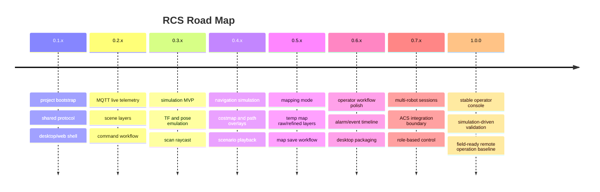
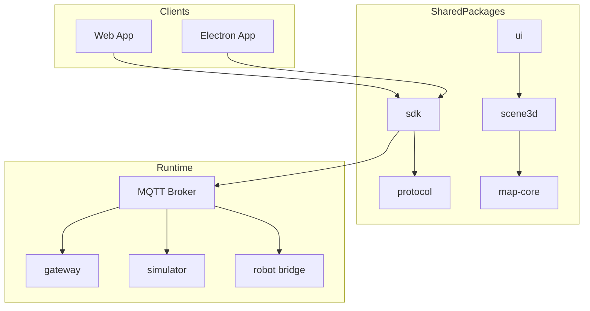

# ROAD MAP



## Product Direction

이 프로젝트는 `amr_viz` 수준의 3D visualization을 기반으로, 실제 운영과 검증까지 가능한 RCS를 만드는 것을 목표로 한다.

- one codebase, two products: desktop + web
- MQTT/WS 하나의 통신 모델로 real robot / simulator / replay session 지원
- operator가 ROS를 몰라도 상태를 읽고 명령을 보낼 수 있는 구조
- simulation은 단순 animation이 아니라 TF, pose, scan, map, path를 실제처럼 내보내는 runtime
- 실로봇과 시뮬레이터가 같은 command / status / feedback 계약을 공유

## Core Architecture Decisions

### 1. UI 전략

- `web-first shared UI core`를 채택한다
- Electron은 shell, file access, local config, auto-update 같은 desktop 책임만 가진다
- scene renderer, MQTT client, dashboard state, protocol parser는 공통 패키지에 둔다

### 2. 통신 전략

- transport는 MQTT를 중심에 둔다
- browser/electron은 WebSocket MQTT endpoint로 직접 접속한다
- request/response/status/feedback/event 토픽을 분리한다
- schema version을 topic name이 아니라 payload metadata에서 관리한다

### 3. 시뮬레이션 전략

- 첫 버전은 `Gazebo-like full physics`가 아니라 `navigation-contract simulator`를 만든다
- 핵심은 실기와 같은 pose, tf, scan, map, status 흐름을 재현하는 것이다
- world 표현은 `pgm + yaml + scenario config`에서 시작한다
- 시뮬레이션 kinematics는 우선 diff-drive 기준으로 한다
- 이후 vehicle spec abstraction으로 ackermann 확장을 열어 둔다

### 4. 운영 모드 전략

- `observe`: telemetry only
- `control`: goal / cancel / initial pose / teleop 허용
- `simulation`: world reset, obstacle injection, replay, map save 허용
- `mapping`: temp map raw/refined, keyframe, graph edge, loop marker 중심 뷰

## Proposed Repository Shape

```text
apps/
  desktop/
  web/
packages/
  protocol/
  sdk/
  ui/
  scene3d/
  map-core/
  sim-core/
services/
  simulator/
  gateway/
docs/
  architecture/
  protocol/
```

## System Architecture



## Rendering Scope Inherited From amr_viz

반드시 초기에 가져가야 할 범위:

- occupancy map texture rendering
- global / local costmap overlays
- global / local plan line rendering
- scan point / ray visualization
- TF frame rendering
- URDF or proxy robot rendering
- goal marker / initial pose marker interaction
- layer visibility profiles for nav / mapping mode

초기에는 보류 가능한 범위:

- complex mesh material fidelity
- multi-camera cinematic views
- advanced volumetric lighting
- full 3D physics debug

## Protocol Design

### Topic Naming

```text
rcs/<targetKind>/<targetId>/viz/*
rcs/<targetKind>/<targetId>/command/*
rcs/<targetKind>/<targetId>/response/*
rcs/<targetKind>/<targetId>/feedback/*
rcs/<targetKind>/<targetId>/status/*
rcs/<targetKind>/<targetId>/event/*
```

`targetKind`:

- `robot`
- `sim`
- `replay`

### Required Command Contracts

#### navigate_to_pose

Payload draft:

```json
{
  "request_id": "1744300000-1001",
  "schema_version": 1,
  "frame_id": "map",
  "goal": {
    "x": 2.5,
    "y": 1.2,
    "yaw": 1.57
  },
  "source": "operator"
}
```

#### set_initial_pose

```json
{
  "request_id": "1744300000-1002",
  "schema_version": 1,
  "frame_id": "map",
  "pose": {
    "x": 0.0,
    "y": 0.0,
    "yaw": 0.0
  }
}
```

#### teleop

```json
{
  "request_id": "1744300000-1003",
  "schema_version": 1,
  "twist": {
    "linear_x": 0.15,
    "angular_z": 0.2
  },
  "timeout_ms": 300
}
```

### Required Visualization State

- map
- temp map raw
- temp map refined
- robot pose
- global path
- local path
- motion status
- scan
- tf
- tf_static
- robot_description
- battery
- slam_graph
- recovery_state
- network_state

## Simulation Design

## 1. World Model

입력:

- `map.yaml`
- `map.pgm`
- scenario json
- optional obstacle asset metadata

내부 상태:

- occupancy grid
- collision grid
- semantic zones: keepout, dock, station, narrow corridor
- dynamic obstacle actors
- robot spawn points

출력:

- world snapshot
- occupancy layers
- collision events
- scenario state

## 2. Robot Kinematics

초기 모델:

- diff-drive only
- velocity command integration
- acceleration limit
- angular velocity limit
- emergency stop state

후속 확장:

- vehicle spec section 도입
- ackermann adapter
- wheelbase, steering limit, turning radius 반영

## 3. TF Emulation

최소 보장 체인:

- `map -> odom`
- `odom -> base_footprint`
- `base_footprint -> base_link`
- optional sensor frames: `laser`, `camera`, `imu_link`

시뮬레이터는 다음을 publish 해야 한다.

- tf
- tf_static
- robot pose
- odom-like motion state

## 4. Sensor Emulation

MVP:

- 2D lidar raycast from occupancy world
- collision contact state
- motion progress state

후속:

- noisy odom
- imu yaw drift
- battery drain model
- network latency and packet drop injection

## 5. Navigation Coupling

두 가지 경로를 모두 고려한다.

### A. Internal navigation simulation

- simulator 내부에 간단한 global planner / local tracker를 둔다
- 장점: 독립 실행이 빠르다
- 단점: 실기 navigation과 차이가 커질 수 있다

### B. External runtime coupling

- 실제 ROS navigation runtime이 시뮬레이터 pose/scan/map를 입력으로 사용한다
- simulator는 센서와 world만 제공한다
- 장점: 실기와 계약이 가장 가깝다
- 단점: 초기 구성 복잡도가 높다

권장 순서:

1. A로 MVP를 만든다
2. B를 검증 경로로 추가한다

## Scene Interaction Design

- left click select pose candidate
- drag or two-click placement for goal / initial pose
- mode-specific toolbar
- nav mode layer preset
- mapping mode layer preset
- follow robot camera toggle
- event-linked focus jump

## Delivery Phases

## Phase 0. Documentation And Contracts

- [ ] README/TODO/CHANGELOG 작성
- [ ] shared topic tree 초안 확정
- [ ] payload schema 초안 확정
- [ ] real robot / simulator 공통 상태 모델 정의

## Phase 1. Workspace Bootstrap

- [ ] monorepo 구조 생성
- [ ] `apps/web`, `apps/desktop`, `packages/*` 기본 scaffold 생성
- [ ] TypeScript config, lint, format, build pipeline 정리
- [ ] shared protocol package 작성

## Phase 2. Shared Operator UI

- [ ] dashboard shell
- [ ] MQTT connection panel
- [ ] session selector
- [ ] event panel
- [ ] scene viewport skeleton
- [ ] nav/mapping layer visibility state

## Phase 3. MQTT Live Integration

- [ ] MQTT client wrapper
- [ ] reconnect/fallback 정책
- [ ] telemetry batching
- [ ] retained static data handling
- [ ] command publish helpers
- [ ] response/feedback/status correlation by `request_id`

## Phase 4. 3D Viz Port From amr_viz Concepts

- [ ] occupancy map texture renderer
- [ ] path renderer
- [ ] scan renderer
- [ ] TF renderer
- [ ] URDF/proxy robot renderer
- [ ] goal and initial pose interaction
- [ ] status panel and mission controls

## Phase 5. Simulation MVP

- [ ] `pgm/yaml` loader
- [ ] world collision model
- [ ] diff-drive kinematics
- [ ] TF emission
- [ ] lidar raycast
- [ ] robot pose and runtime status publish
- [ ] world reset and spawn control

## Phase 6. Navigation-Aware Simulation

- [ ] simulated global path
- [ ] simulated local path
- [ ] simulated costmaps
- [ ] blocked / recovering / reached state machine
- [ ] scenario replay and obstacle injection

## Phase 7. Real Runtime Coupling

- [ ] ROS 2 adapter for simulator input/output
- [ ] real navigation stack loopback test
- [ ] TF and timestamp consistency check
- [ ] same command contract for real/sim target

## Phase 8. Operator-Grade Stabilization

- [ ] desktop packaging
- [ ] persistent settings
- [ ] audit/event history
- [ ] alarm severity model
- [ ] multi-robot and multi-session routing
- [ ] role-based feature gating

## MVP Exit Criteria

- desktop and web app가 같은 scene와 panel을 사용한다
- MQTT broker 하나로 real robot 또는 simulator에 접속 가능하다
- operator가 goal, cancel, initial pose를 보낼 수 있다
- scene에서 map, scan, tf, path, robot pose를 확인할 수 있다
- simulator가 TF, pose, scan을 publish 한다
- same UI에서 real/sim session 전환이 가능하다

## Risks To Resolve Early

- Electron-specific code가 shared UI에 스며들 위험
- robot topic과 simulation topic이 초기에 분리 설계되어 contract가 달라질 위험
- 3D renderer가 상태 관리와 과도하게 결합될 위험
- simulation fidelity 욕심 때문에 MVP가 늦어질 위험
- ROS message mirror와 web-friendly JSON 사이 경계가 불명확해질 위험

## Immediate Candidate Tracks

- `shared web core + Electron shell` 구조를 먼저 고정
- MQTT topic naming과 request correlation 방식을 먼저 고정
- `amr_viz`에서 가져올 rendering 단위를 파일 수준이 아니라 기능 수준으로 분해
- simulation MVP는 `map + pose + tf + scan`까지만 먼저 완료
- navigation coupling은 simulator standalone MVP 이후 진행

# Daily TODO Memo

## Active Queue

| Date | Detail |
| --- | --- |
| `2026-04-10` | RCS 문서 초안 정리, desktop/web 공통 아키텍처 결정, MQTT contract 1차 설계 |
| `2026-04-10` | simulation MVP 범위를 Gazebo 대체가 아닌 navigation-contract simulator로 제한 |
| `2026-04-10` | `amr_viz` 계열 3D layer를 RCS shared scene package로 재구성하는 방향 확정 |

## 2026-04-10

- RCS 초기 제품 방향 정의
  - `amr_viz`를 viewer가 아닌 operator console의 출발점으로 사용
  - desktop와 web은 별도 제품이 아니라 shared UI core를 공유하도록 설계
  - Electron은 shell 책임만 가지게 하여 운영 화면 로직의 중복을 막는 방향 채택
- MQTT/WS 통신 모델 1차 설계
  - `command / response / feedback / status / event / viz` 토픽군을 분리
  - robot과 simulator가 같은 계약을 쓰도록 `targetKind / targetId` 구조 도입
  - `request_id` 기반 상관관계와 schema version 필드 도입
- simulation 방향 1차 설계
  - `pgm + yaml`을 world source로 사용
  - Gazebo 수준 full physics가 아니라 TF, pose, scan, map 흐름을 먼저 맞추는 시뮬레이터로 시작
  - 초기 target은 diff-drive, 이후 ackermann 확장을 위한 vehicle abstraction은 열어 두기
- 다음 구현 전 바로 필요한 설계 포인트
  - package 경계: `protocol`, `scene3d`, `sim-core`, `sdk`
  - scene interaction 모델: goal / initial pose / follow / mapping preset
  - real runtime coupling 시 timestamp, tf tree, retained topic 정책 정리